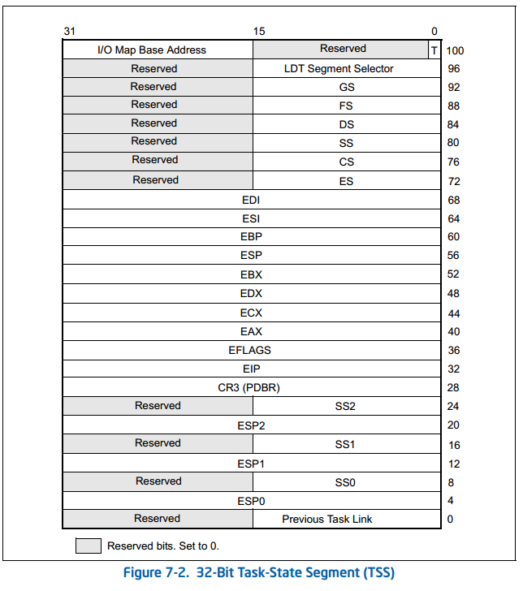

[DOC]


郑刚《操作系统真相还原》实践代码
#### 重新运行需要更改 bochrc.disk 中的路径为决定路径，具体的查看 c1 文件夹中的 README.md 文件

## 知识记录
程序中各种数据结构的访问：该数据结构的起始地址 + 该数据结构所占用内存大小来实现

通用寄存器惯用法约定

| 寄存器 | 助记名称                       | 功能描述                                                                                                                                                                                              | 
|:----|:---------------------------|:--------------------------------------------------------------------------------------------------------------------------------------------------------------------------------------------------|
| ax  | 累加器（Accumulator）           | 使用频度较高，常用于算术运算、逻辑运算，保存与外设输入输出数据                                                                                                                                                                   |
| bx  | 基址寄存器（base）                | 常用来存在内存地址，以此地址作为基址，用来遍历一篇区域                                                                                                                                                                       |
| cx  | 计数器（counter）               | 计数器的作用用来计数，所以常用于循环指令中的循环次数                                                                                                                                                                        |
| dx  | 数据寄存器（data）                | 可用于存放数据，通常情况下只用于保存外设控制器的端口号地址                                                                                                                                                                     |
| si  | 源变址寄存器（source index）       | 常用于字符串操作中的数据源地址，既被传送的数据在哪里。通常与其他指令配合使用，如批量数据传送指令族 movs[bwd]                                                                                                                                       |
| di  | 目的变址寄存器（destination index） | 和si一样，常用于字符串操作。但di是用于数据的目的地址                                                                                                                                                                      |
| sp  | 栈指针寄存器（stack pointer）      | 其段基址是SS，用来指向栈顶。随着栈中数据的进出，push、pop操作会修改sp的值                                                                                                                                                        |
| bp  | 基址寄存器（base pointer）        | 访问栈有两种方式，一种是push、pop指令操作栈，sp指针的值会自动更新，但我们只能获取到栈顶sp指针指向的数据。很多时候，我们需要读写在栈顶与栈底之间的数据。处理器为了让开发人员方便控制栈中数据，还提供了把栈当成数据段来访问的方式，既提供了寄存器bp，所以bp默认的寄存器就是SS，可通过SS:bp的方式将栈当作普通的数据段来访问，只不过bp不像sp那样随着push、pop自动改变 |

##指令

CPU前进的方向永远是 CS：IP这，两个寄存器，CS寄存器是代码段段基址，IP寄存器是代码段的段内偏移地址，CS * 16 + IP 就是CPU执行指令的内存地址。

ret: 在栈顶（寄存器ss:sp所指向的地址）弹出2字节的内容来替换IP寄存器，ret指令不管里面的内容是什么，它只负责将当前栈顶的内容弹出栈，并用他为IP寄存器赋值。保护模式弹出4字节，实模式2字节

ref：同上，不过是弹出4字节

call：call指令会在栈中留下返回地址（IP寄存器的值）

## Bochs常用调试命令

| 作用                | 命令            | 示例                |
|:------------------|:--------------|:------------------|
| 在某物理地址设置断点        | 	b addr       | 	b 0x7c00         |
| 显示当前所有断点信息        | 	info break   | 	info break       |
| 继续执行，直至遇到断点       | 	c            | 	c                |
| 单步执行	             | s	            | s                 |
| 单步执行（遇到函数跳过）      | 	n            | 	n                |
| 查看寄存器信息	          |               |                   |
| 查看堆栈              | 	print-stack  | 	print-stack      |
| 查看内存物理地址内容        | 	xp /nuf addr | 	xp /40bx 0x9013e |
| 查看线性地址内容	         | x /nuf addr   | 	x /40bx 0x13e    |
| 反汇编一段内存           | 	u start end	 | u 0x30400 0x3040d |
| 反汇编执行的每一条指令	      | trace-on	     | trace-on          |
| 每执行一条指令就打印 CPU 信息 | 	trace-reg    | 	trace-reg        |

## 函数调用

```shell
int subtract（int a, int b）; // 被调用者
int sub = subtract(3, 2); // 主调用者
```

主调用者：
```shell
; 从右至左将参数入栈
push 2
push 3
call substract
add esp, 8
```

被调用者
```shell
push ebp
mov ebp, esp
mov eax,[ebp + 0x8]
add eax,[ebp + 0xc]

mov esp, ebp

pop ebp
ret
```

## C中struct的内存布局

在C语言中，C对象的属性的顺序通常与它们加载到内存中的顺序一致。这意味着，如果您定义了一个结构体或类，属性的声明顺序将影响它们在内存中的布局。

例如，考虑以下C结构体的定义：

```c
struct Person {
    int age;
    char gender;
    float height;
};
```

在这个结构体中，`age`属性在内存中的地址将位于最低的地址，然后是`gender`属性，最后是`height`属性。因此，属性的顺序在内存中的顺序是一致的。

但需要注意的是，C标准没有明确规定内存对齐规则。因此，编译器可能会在属性之间插入一些填充字节，以确保属性位于适当的内存边界上。这些填充字节的存在可能会导致属性之间有一些额外的内存，以确保满足对齐要求。

另外，如果您使用特定编译器的编译选项来指定内存对齐方式，属性的布局可能会有所不同。

因此，虽然属性的声明顺序通常与它们在内存中的布局一致，但在某些情况下，编译器可能会进行一些调整以满足对齐和性能的要求。如果属性的布局顺序对您的应用程序非常重要，您可以查看编译器的文档，以了解如何进行显式的内存布局控制。


## TSS

Task State Segment 是任务运行时的状态。TSS的切换就是任务的切换

TR(Task Regist) 负责存储TSS的起始位置和偏移大小。任务的切换就是TR内容的切换。

Linux为每个CPU都创建一个TSS，在各个CPU上的所有任务共享同一个TSS，各个CPU的TR寄存器保存各CPU的TSS，在用ltr指令加载TSS后，该TR寄存器永远指向同一个TSS，之后再也不会重新加载TSS。在进程切换时，只需要将TSS中的SS
0和esp0更新为新任务的内核栈的段地址和栈指针。
Linux在TSS中只初始化了SS0，esp0和I/O位图，除此之外TSS便没用了。



## 实现用户进程

进程的虚拟地址连续，而物理地址不连续，需要为每个进程维护一个虚拟地址池，用此地址池来记录该进程的虚拟空间中，那些已被分配，那些可以分配。

进程与线程的区别就是进程拥有独立的地址空间，不同的地址空间就是不同的页面，因此需要为每一个进程创建页面

所有的PCB都在内核空间中

用户程序的装载本质上是将用户程序中类型为LOAD的段拷贝到指定的内存地址
