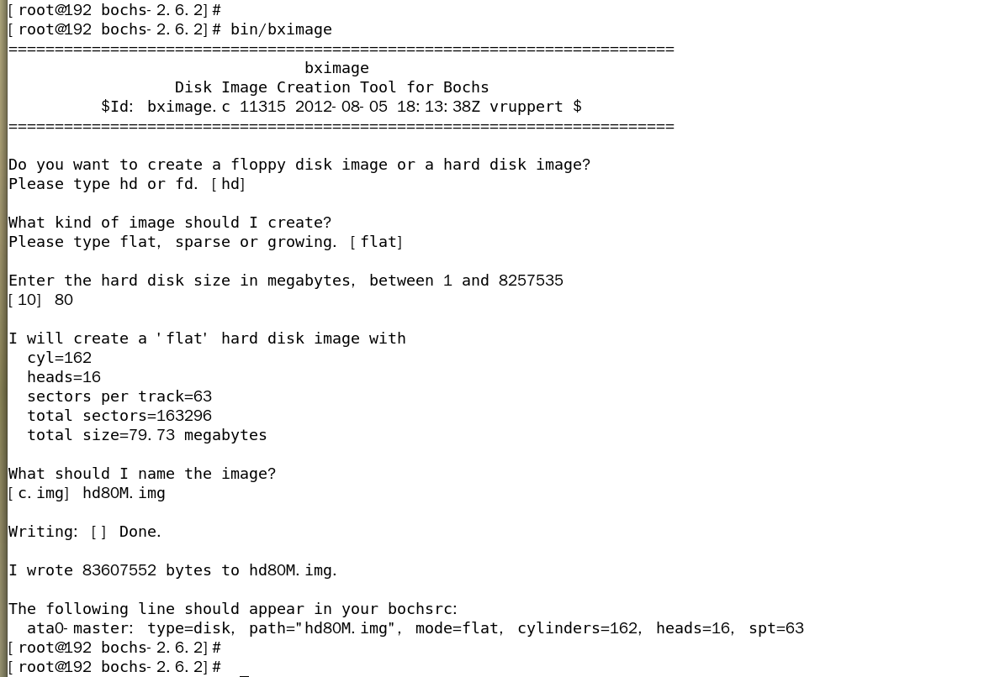
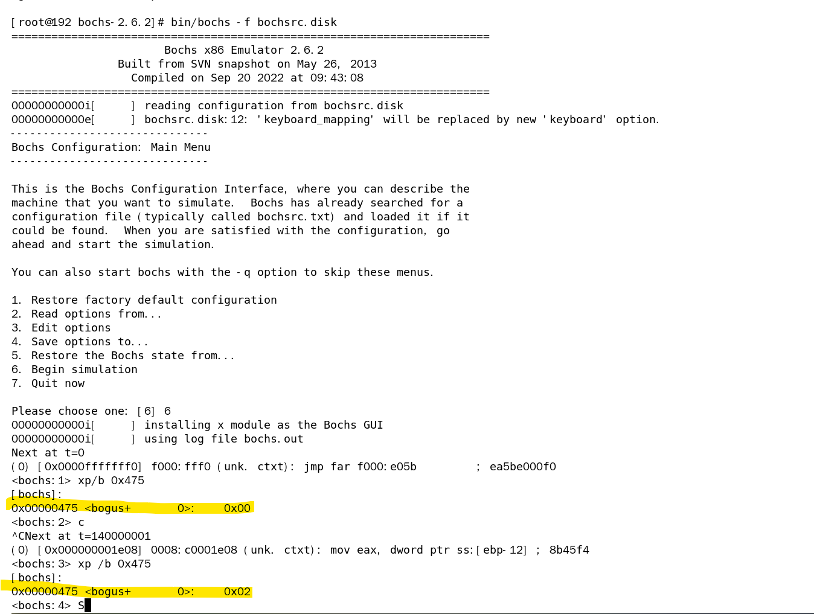

参考：[用《操作系统真象还原》写一个操作系统 第十三章 编写硬盘驱动程序 第一节 创建从盘并分区、创建数据结构并初始化](https://www.bilibili.com/video/BV1Qj41197ut/?spm_id_from=333.999.0.0&vd_source=001f23892568695ec0527ab967b620a7)

### 1. 创建 hd80M.img



### 2. 更新硬盘配置文件 bochsrc.disk

```shell

megs: 32

romimage:    file=/home/haifei/github/elephant-study/bochs-2.6.2/share/bochs/BIOS-bochs-latest
vgaromimage: file=/home/haifei/github/elephant-study/bochs-2.6.2/share/bochs/VGABIOS-lgpl-latest

boot: disk

log: bochs.out
mouse: enabled=0

keyboard_mapping: enabled=1, map=/home/haifei/github/elephant-study/bochs-2.6.2/share/bochs/keymaps/x11-pc-us.map

ata0: enabled=1, ioaddr1=0x1f0, ioaddr2=0x3f0, irq=14
ata0-master: type=disk, path="hd60M.img", mode=flat, cylinders=121, heads=16, spt=63
ata0-slave: type=disk, path="hd80M.img", mode=flat, cylinders=162, heads=16, spt=63

#gdbstub: enabled=1, port=1234, text_base=0, data_base=0, bss_base=0

```

### 3. 检验磁盘成功



### 4. 设置磁盘分区

```shell
[root@192 bochs-2.6.2]# fdisk hd80M.img 
欢迎使用 fdisk (util-linux 2.23.2)。

更改将停留在内存中，直到您决定将更改写入磁盘。
使用写入命令前请三思。

Device does not contain a recognized partition table
使用磁盘标识符 0xad64c481 创建新的 DOS 磁盘标签。

命令(输入 m 获取帮助)：x

专家命令(输入 m 显示帮助)：c
柱面数 (1-1048576，默认为 10)：162

专家命令(输入 m 显示帮助)：h
磁头数 (1-256，默认为 255)：16

专家命令(输入 m 显示帮助)：r

命令(输入 m 获取帮助)：n
Partition type:
   p   primary (0 primary, 0 extended, 4 free)
   e   extended
Select (default p): p
分区号 (1-4，默认 1)：
起始 扇区 (2048-163295，默认为 2048)：2048
Last 扇区, +扇区 or +size{K,M,G} (2048-163295，默认为 163295)：33263
分区 1 已设置为 Linux 类型，大小设为 15.2 MiB

命令(输入 m 获取帮助)：n
Partition type:
   p   primary (1 primary, 0 extended, 3 free)
   e   extended
Select (default p): e
分区号 (2-4，默认 2)：4
起始 扇区 (33264-163295，默认为 34816)：33264
Last 扇区, +扇区 or +size{K,M,G} (33264-163295，默认为 163295)：163295
分区 4 已设置为 Extended 类型，大小设为 63.5 MiB

命令(输入 m 获取帮助)：p

磁盘 hd80M.img：83 MB, 83607552 字节，163296 个扇区
Units = 扇区 of 1 * 512 = 512 bytes
扇区大小(逻辑/物理)：512 字节 / 512 字节
I/O 大小(最小/最佳)：512 字节 / 512 字节
磁盘标签类型：dos
磁盘标识符：0xad64c481

    设备 Boot      Start         End      Blocks   Id  System
hd80M.img1            2048       33263       15608   83  Linux
hd80M.img4           33264      163295       65016    5  Extended

命令(输入 m 获取帮助)：n
Partition type:
   p   primary (1 primary, 1 extended, 2 free)
   l   logical (numbered from 5)
Select (default p): l
添加逻辑分区 5
起始 扇区 (35312-163295，默认为 36864)：35312
Last 扇区, +扇区 or +size{K,M,G} (35312-163295，默认为 163295)：51407
分区 5 已设置为 Linux 类型，大小设为 7.9 MiB

命令(输入 m 获取帮助)：n
Partition type:
   p   primary (1 primary, 1 extended, 2 free)
   l   logical (numbered from 5)
Select (default p): l
添加逻辑分区 6
起始 扇区 (53456-163295，默认为 55296)：53456
Last 扇区, +扇区 or +size{K,M,G} (53456-163295，默认为 163295)：76607
分区 6 已设置为 Linux 类型，大小设为 11.3 MiB

命令(输入 m 获取帮助)：n
Partition type:
   p   primary (1 primary, 1 extended, 2 free)
   l   logical (numbered from 5)
Select (default p): l
添加逻辑分区 7
起始 扇区 (78656-163295，默认为 79872)：78656
Last 扇区, +扇区 or +size{K,M,G} (78656-163295，默认为 163295)：91727
分区 7 已设置为 Linux 类型，大小设为 6.4 MiB

命令(输入 m 获取帮助)：n
Partition type:
   p   primary (1 primary, 1 extended, 2 free)
   l   logical (numbered from 5)
Select (default p): l
添加逻辑分区 8
起始 扇区 (93776-163295，默认为 94208)：93776
Last 扇区, +扇区 or +size{K,M,G} (93776-163295，默认为 163295)：121967
分区 8 已设置为 Linux 类型，大小设为 13.8 MiB

命令(输入 m 获取帮助)：n
Partition type:
   p   primary (1 primary, 1 extended, 2 free)
   l   logical (numbered from 5)
Select (default p): l
添加逻辑分区 9
起始 扇区 (124016-163295，默认为 124928)：124016
Last 扇区, +扇区 or +size{K,M,G} (124016-163295，默认为 163295)：163295
分区 9 已设置为 Linux 类型，大小设为 19.2 MiB

命令(输入 m 获取帮助)：p

磁盘 hd80M.img：83 MB, 83607552 字节，163296 个扇区
Units = 扇区 of 1 * 512 = 512 bytes
扇区大小(逻辑/物理)：512 字节 / 512 字节
I/O 大小(最小/最佳)：512 字节 / 512 字节
磁盘标签类型：dos
磁盘标识符：0xad64c481

    设备 Boot      Start         End      Blocks   Id  System
hd80M.img1            2048       33263       15608   83  Linux
hd80M.img4           33264      163295       65016    5  Extended
hd80M.img5           35312       51407        8048   83  Linux
hd80M.img6           53456       76607       11576   83  Linux
hd80M.img7           78656       91727        6536   83  Linux
hd80M.img8           93776      121967       14096   83  Linux
hd80M.img9          124016      163295       19640   83  Linux

命令(输入 m 获取帮助)：t
分区号 (1,4-9，默认 9)：5
Hex 代码(输入 L 列出所有代码)：66
已将分区“Linux”的类型更改为“未知”

命令(输入 m 获取帮助)：m
命令操作
   a   toggle a bootable flag
   b   edit bsd disklabel
   c   toggle the dos compatibility flag
   d   delete a partition
   g   create a new empty GPT partition table
   G   create an IRIX (SGI) partition table
   l   list known partition types
   m   print this menu
   n   add a new partition
   o   create a new empty DOS partition table
   p   print the partition table
   q   quit without saving changes
   s   create a new empty Sun disklabel
   t   change a partition's system id
   u   change display/entry units
   v   verify the partition table
   w   write table to disk and exit
   x   extra functionality (experts only)

命令(输入 m 获取帮助)：t
分区号 (1,4-9，默认 9)：6
Hex 代码(输入 L 列出所有代码)：66
已将分区“Linux”的类型更改为“未知”

命令(输入 m 获取帮助)：t
分区号 (1,4-9，默认 9)：7
Hex 代码(输入 L 列出所有代码)：66
已将分区“Linux”的类型更改为“未知”

命令(输入 m 获取帮助)：t
分区号 (1,4-9，默认 9)：8
Hex 代码(输入 L 列出所有代码)：66
已将分区“Linux”的类型更改为“未知”

命令(输入 m 获取帮助)：t
分区号 (1,4-9，默认 9)：9
Hex 代码(输入 L 列出所有代码)：66
已将分区“Linux”的类型更改为“未知”

命令(输入 m 获取帮助)：p

磁盘 hd80M.img：83 MB, 83607552 字节，163296 个扇区
Units = 扇区 of 1 * 512 = 512 bytes
扇区大小(逻辑/物理)：512 字节 / 512 字节
I/O 大小(最小/最佳)：512 字节 / 512 字节
磁盘标签类型：dos
磁盘标识符：0xad64c481

    设备 Boot      Start         End      Blocks   Id  System
hd80M.img1            2048       33263       15608   83  Linux
hd80M.img4           33264      163295       65016    5  Extended
hd80M.img5           35312       51407        8048   66  未知
hd80M.img6           53456       76607       11576   66  未知
hd80M.img7           78656       91727        6536   66  未知
hd80M.img8           93776      121967       14096   66  未知
hd80M.img9          124016      163295       19640   66  未知

命令(输入 m 获取帮助)：w
The partition table has been altered!

正在同步磁盘。
[root@192 bochs-2.6.2]# fdisk -l hd80M.img

磁盘 hd80M.img：83 MB, 83607552 字节，163296 个扇区
Units = 扇区 of 1 * 512 = 512 bytes
扇区大小(逻辑/物理)：512 字节 / 512 字节
I/O 大小(最小/最佳)：512 字节 / 512 字节
磁盘标签类型：dos
磁盘标识符：0xad64c481

    设备 Boot      Start         End      Blocks   Id  System
hd80M.img1            2048       33263       15608   83  Linux
hd80M.img4           33264      163295       65016    5  Extended
hd80M.img5           35312       51407        8048   66  未知
hd80M.img6           53456       76607       11576   66  未知
hd80M.img7           78656       91727        6536   66  未知
hd80M.img8           93776      121967       14096   66  未知
hd80M.img9          124016      163295       19640   66  未知
[root@192 bochs-2.6.2]# 
```